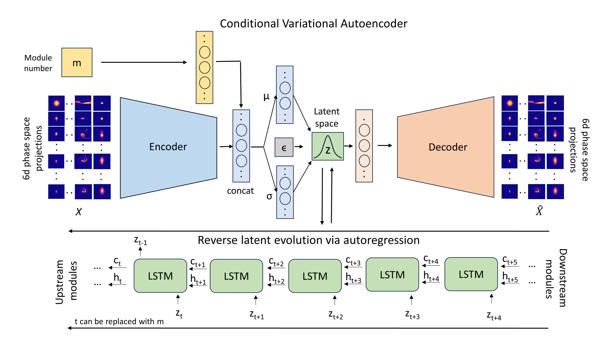

# rLEM
Note: Read the details of the project are given below. The code is currently under scrutiny for open-source at LANL.
### Reverse latent evolution model (rLEM) for time-inversion of spatiotemporal dynamics
##### It combines a conditional variational autoencoder (CVAE) to project high-dimensional data into a lower-dimensional latent distribution. Subsequently, a LSTM network learns the reverse temporal dynamics within this latent space. During the prediction stage, both networks are integrated into an autoregressive loop to estimate all the upstream phase space projections given limited downstream measurements.

  

##### This repository contains codes accompanying the [paper](https://arxiv.org/abs/). 

##### The dataset accompying the paper is available at Zenodo.  
